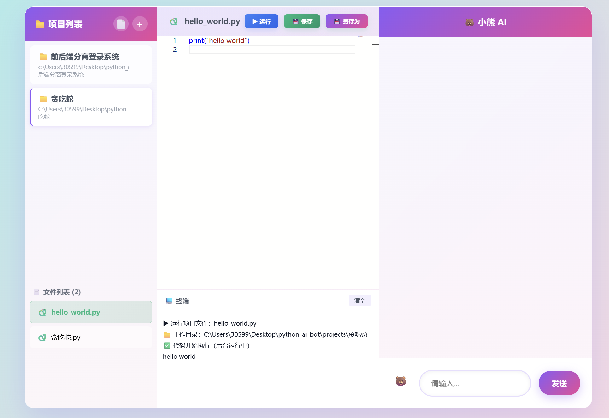

# 小熊 AI Web IDE（Flask + SQLite + Aider）

一个本地运行的 Web IDE：支持项目管理、文件编辑、代码运行、终端输出、普通 AI 聊天（通义千问）和 Aider 代码改写模式。

## 1：欢迎界面


## 2：代码编辑界面


## 功能概览

- 项目管理
  - 创建/删除项目
  - 项目文件扫描与列表展示
- 文件管理
  - 新建、打开、保存、另存为、删除文件
- 编辑器 + 终端
  - Monaco 编辑器
  - 运行/停止 Python、JavaScript 代码
  - Web 服务检测与运行状态管理
- AI 聊天
  - Socket.IO 流式返回（通义千问）
  - 支持停止生成、重新生成、代码块复制/运行/保存
- Aider 模式
  - 从聊天区触发 Aider 改码
  - 支持上下文文件选择（add/clear）
  - 运行结束后自动同步文件到数据库

## 技术栈

- 后端: Flask, Flask-SocketIO, Flask-CORS, SQLite
- 前端: HTML + CSS + JavaScript + Monaco
- AI:
  - 普通聊天: DashScope（通义千问）
  - 代码改写: Aider + OpenAI 兼容接口（当前代码默认 DeepSeek API Base）

## 项目结构

```text
python_ai_bot/
├─ app.py
├─ templates/
│  └─ index.html
├─ projects/                  # 你的项目根目录（每个项目一个子目录）
├─ ai_code_manager.db         # SQLite 数据库
├─ requirements.txt
└─ README.md
```

## 环境要求

- Python 3.10+
- Windows / Linux / macOS
- 可联网（用于模型 API）

## 安装

```bash
pip install -r requirements.txt
```

## 环境变量

### 1) 普通 AI 聊天（通义千问）

必须配置：

- `qinwen_api_key`

Windows PowerShell:

```powershell
setx qinwen_api_key "你的通义千问key"
# 当前终端立刻生效（可选）
$env:qinwen_api_key="你的通义千问key"
```

### 2) Aider 模式（代码改写）

至少配置一个：

- `OPENAI_API_KEY` 或 `DEEPSEEK_API_KEY`

建议同时配置（如果你走 DeepSeek 兼容 OpenAI）：

- `OPENAI_API_BASE=https://api.deepseek.com`

PowerShell 示例：

```powershell
setx OPENAI_API_KEY "你的key"
setx OPENAI_API_BASE "https://api.deepseek.com"
```

## 运行

```bash
python app.py
```

启动后访问：

- 本机: [http://127.0.0.1:5000](http://127.0.0.1:5000)
- 局域网: `http://你的局域网IP:5000`

## 使用流程（建议）

1. 新建项目（指定绝对路径）
2. 新建或打开文件
3. 在编辑器编写代码并保存
4. 点击运行查看终端输出
5. 需要 AI 改码时切到 Aider 模式并发送需求

## Aider 推荐预设（可选）

```powershell
setx AIDER_YES_ALWAYS "1"
setx AIDER_NO_GIT "1"
setx AIDER_NO_GITIGNORE "1"
```

如果你想把 Aider 历史文件统一到一个目录：

```powershell
setx AIDER_INPUT_HISTORY_FILE "C:\Users\30599\Desktop\python_ai_bot\.aider_data\input.history"
setx AIDER_CHAT_HISTORY_FILE "C:\Users\30599\Desktop\python_ai_bot\.aider_data\chat.history.md"
```

## API 简表（核心）

- `GET /api/projects` 获取项目列表
- `POST /api/projects` 创建项目
- `DELETE /api/projects/<id>` 删除项目
- `GET /api/projects/<id>/files` 获取项目文件
- `POST /api/files` 新建/保存文件
- `GET /api/files/<id>` 获取文件内容
- `DELETE /api/files/<id>` 删除文件
- `POST /api/run` 运行代码（snippet/project/aider）
- `POST /api/output` 轮询输出
- `POST /api/stop` 停止运行
- `POST /api/aider/context/select` 选择 Aider 上下文
- `POST /api/aider/context/clear` 清除 Aider 上下文
- `GET /api/aider/context` 查询当前上下文

## 常见问题

- 重启后环境变量看不到  
  `setx` 只对新进程生效。重开 IDE/终端后再看。

- 局域网访问时 AI 一直转圈  
  检查 API Key、跨机器访问地址、以及后端是否绑定 `0.0.0.0`。

- Aider 创建了奇怪文件名  
  建议开启 `--yes-always` 前先收紧 prompt，并尽量给明确目标文件。

## 开发说明

- 数据库启动时会启用 `PRAGMA foreign_keys = ON`
- 启动会自动初始化表结构并清理孤儿记录
- 建议把 `projects/` 与数据库定期备份
```
