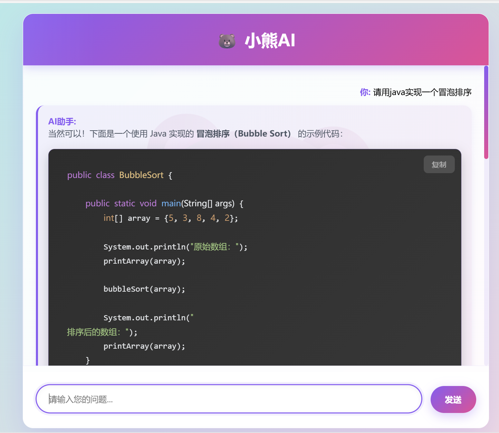
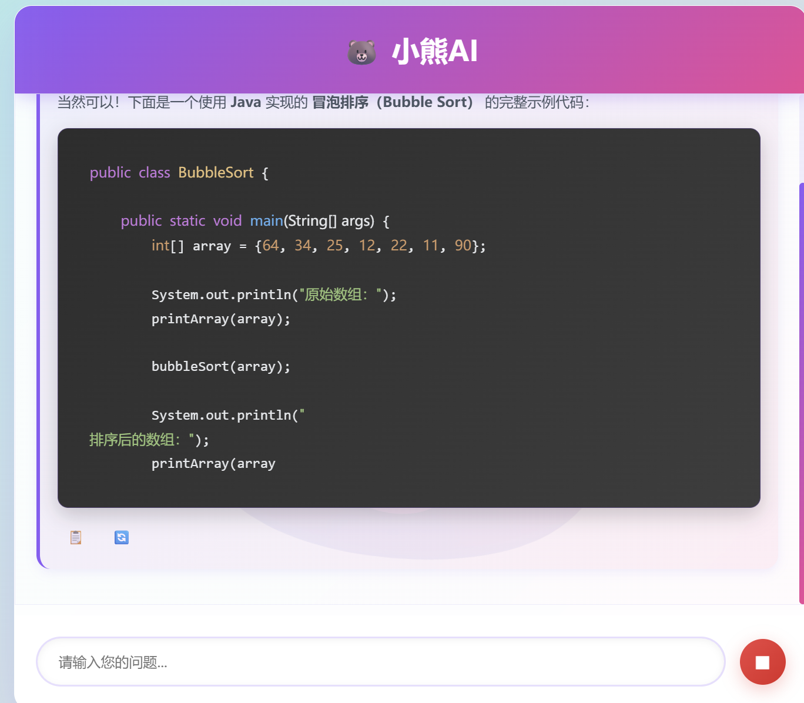

# 🐻 小熊AI助手

一个基于通义千问API的智能对话助手，支持Web界面和终端两种交互方式，提供流式对话体验和对话历史记忆功能。

## ✨ 功能特点

- 🌐 **Web界面**：精美的渐变UI设计，支持实时流式对话
- 💬 **对话记忆**：自动保存最近5轮对话，支持上下文理解
- ⚡ **流式输出**：打字机效果，实时展示AI回答过程
- 📋 **复制功能**：一键复制AI回答内容
- 🔄 **重新生成**：对最新回答不满意可重新生成
- ⏹️ **停止生成**：随时中断AI回答
- 🖥️ **终端模式**：支持命令行下的AI对话
- 📝 **Markdown渲染**：支持代码高亮和格式化显示
- 🎨 **代码复制**：代码块一键复制功能

## 🛠️ 技术栈

- **后端框架**: Flask + Flask-SocketIO
- **前端技术**: HTML5 + JavaScript + WebSocket
- **AI模型**: 阿里云通义千问 (DashScope API)
- **Markdown**: marked.js + highlight.js

## 📋 前置要求

- Python 3.7+
- 阿里云通义千问API密钥

## 🚀 快速开始

### 1. 克隆项目

```bash
git clone https://github.com/你的用户名/python_ai_bot.git
cd python_ai_bot
```

### 2. 安装依赖

```bash
pip install flask flask-socketio dashscope
```

### 3. 配置API密钥

设置环境变量（Windows PowerShell）：
```powershell
$env:qinwen_api_key = "你的通义千问API密钥"
```

或者设置环境变量（Linux/Mac）：
```bash
export qinwen_api_key="你的通义千问API密钥"
```

### 4. 运行Web版本

```bash
python app.py
```

然后在浏览器访问：`http://localhost:5000`

### 5. 运行终端版本

```bash
python 终端版ai助手.py
```

## 📁 项目结构

```
python_ai_bot/
├── app.py                 # Web服务主程序
├── 终端版ai助手.py        # 终端版AI助手
├── templates/
│   └── index.html        # Web界面模板
└── README.md             # 项目说明文档
```

## 💡 使用说明

### Web界面使用

1. 在输入框输入你的问题
2. 点击"发送"或按Enter键提交
3. AI会实时流式返回回答
4. 可以点击📋复制回答内容
5. 点击⏹停止AI生成
6. 最新回答支持🔄重新生成

### 终端使用

1. 运行终端版程序
2. 输入问题后按Enter
3. 输入`exit`或`quit`退出程序

## 🎯 核心功能实现

### 对话记忆机制

使用Python列表存储最近5轮对话（10条消息），超过限制自动删除最早的对话：

```python
# 保留最后10条消息（5轮对话）
if len(user_histories[user_id]) > 10:
    user_histories[user_id] = user_histories[user_id][-10:]
```

### 历史对话控制

- ✅ 所有对话支持复制功能
- ✅ 仅最新对话支持重新生成
- ⏹ 历史对话的重新生成按钮已禁用

## 🎨 界面预览



### 界面特色

- 🎨 渐变背景设计
- 🐻 可爱的小熊主题
- ✨ 流畅的动画效果
- 💻 代码高亮显示
- 📱 响应式布局
- 🌈 紫粉色渐变主题

## 📝 API配置

获取通义千问API密钥：
1. 访问 [阿里云DashScope](https://dashscope.aliyun.com/)
2. 注册/登录账号
3. 创建API密钥
4. 设置环境变量

## 🔧 自定义配置

### 修改对话记忆轮数

在 `app.py` 中修改：

```python
# 修改保留的消息数量（轮数 × 2）
if len(user_histories[user_id]) > 10:  # 改为其他数字
    user_histories[user_id] = user_histories[user_id][-10:]
```

### 修改AI模型

```python
responses = Generation.call(
    model="qwen-turbo",  # 可改为 qwen-plus, qwen-max 等
    # ...
)
```

## 🐛 常见问题

**Q: 提示API密钥错误？**  
A: 确保环境变量 `qinwen_api_key` 已正确设置

**Q: 历史对话复制失败？**  
A: 请使用 Ctrl+Shift+R 硬刷新浏览器清除缓存

**Q: WebSocket连接失败？**  
A: 检查防火墙设置，确保5000端口未被占用

## 📄 开源协议

MIT License

## 👨‍💻 作者

欢迎提交Issue和Pull Request！

## 🙏 致谢

- [阿里云通义千问](https://tongyi.aliyun.com/)
- [Flask](https://flask.palletsprojects.com/)
- [marked.js](https://marked.js.org/)
- [highlight.js](https://highlightjs.org/)

---

⭐ 如果这个项目对你有帮助，请给个Star支持一下！
